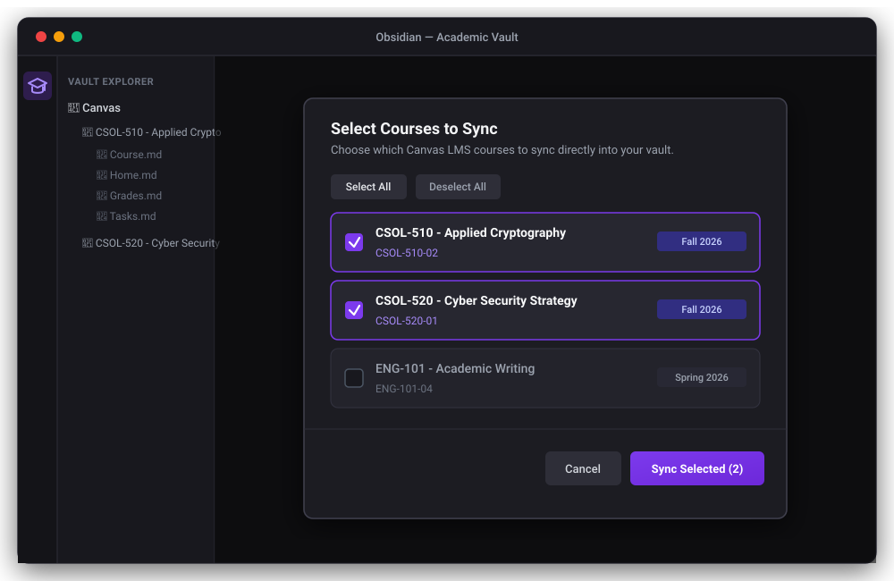
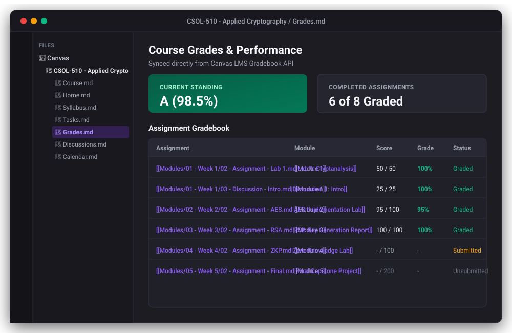

# Canvas Sync for Obsidian

[](LICENSE)
[](package.json)
[](https://github.com/SixFiveMil/obsidian-canvas-sync/actions/workflows/ci.yml)
[](https://www.typescriptlang.org/)
[](https://community.obsidian.md/plugins/canvas-sync-bridge)
[](PRIVACY.md)

> Seamlessly sync Canvas LMS courses, modules, assignments, discussions, grades, files, and calendars directly into your Obsidian knowledge vault as clean, structured, and cross-linked Markdown notes.

---

## ✨ Key Features

- 🎓 **Direct Canvas LMS API Sync**: Connects directly to Canvas via Obsidian's native `requestUrl`. No companion browser extensions, local proxy servers, or third-party cloud bridges required.
- 🗂️ **Interactive Course Selector**: Select and sync individual active or concluded courses with a single click using the ribbon icon or command palette.
- 📊 **Comprehensive Course Data**:
  - **Course & Home**: Course overview, instructor contact cards, home page graphics, and syllabus.
  - **Modules**: Module hierarchies, lecture pages, readings, and external resource links.
  - **Assignments & Rubrics**: Due dates, points possible, submission instructions, and structured rubric criteria tables.
  - **Student Submissions & Grades**: Live gradebook standing (`Grades.md`), score breakdowns, submitted files, and instructor comments.
  - **Discussions**: Full discussion topics, announcements, and multi-level student reply trees.
  - **Calendar**: Milestone deadlines, schedule events, and Zoom meeting links (`Calendar.md`).
- 🔗 **Internal Obsidian Wikilinks**: Automatically cross-links course materials into native Obsidian `[[wikilinks]]`, complete with table pipe escaping (`[[path\|alias]]`) for clean rendering.
- 📥 **Local File & Asset Downloader**: Downloads embedded images, assignment attachments, and course documents (`.pdf`, `.docx`, `.pptx`, `.xlsx`, `.zip`) locally with configurable size and extension filters.
- 🔒 **100% Local-First & Private**: Your API token and course data remain strictly within your vault. Zero telemetry, zero analytics.

---

## 📸 Screenshots

| 1. Interactive Course Selector | 2. Course Home & Module Hub |
| :---: | :---: |
|  |  |

| 3. Gradebook & Task Tracker | 4. Granular Plugin Settings |
| :---: | :---: |
|  |  |

---

## 🚀 Quick Start & Installation

### Step 1: Install the Plugin in Obsidian

#### Method A: Community Plugins (Recommended)
1. In Obsidian, open **Settings** > **Community Plugins**.
2. Turn off **Restricted mode** if prompted.
3. Search for **Canvas Sync Bridge**, click **Install**, and then **Enable**.

#### Method B: Obsidian BRAT (Beta Releases)
1. Install the [BRAT Plugin](https://github.com/TfTHacker/obsidian42-brat) in Obsidian.
2. In BRAT settings, click **Add Beta plugin** and enter: `https://github.com/SixFiveMil/obsidian-canvas-sync`.

#### Method C: Manual Installation
1. Download `main.js` and `manifest.json` from the [Latest GitHub Release](https://github.com/SixFiveMil/obsidian-canvas-sync/releases/latest).
2. Create a folder named `canvas-sync-bridge` inside your vault at `<Vault>/.obsidian/plugins/canvas-sync-bridge/`.
3. Copy `main.js` and `manifest.json` into that folder and restart Obsidian.

---

### Step 2: Generate a Canvas Access Token

1. Log in to your Canvas LMS instance in your web browser.
2. Click **Account** in the left navigation bar > **Settings**.
3. Scroll down to **Approved Integrations** and click **+ New Access Token**.
4. Set a purpose (e.g. `Obsidian Sync`) and optional expiration date, then click **Generate Token**.
5. Copy the generated token string immediately *(Canvas only displays it once)*.

---

### Step 3: Configure the Plugin

1. In Obsidian, go to **Settings** > **Canvas Sync** (under Community Plugins).
2. Enter your **Canvas Base URL** (e.g. `https://canvas.instructure.com` or your university URL like `https://sandiego.instructure.com`).
3. Paste your **Canvas API Access Token**.
4. Customize your download filters, folder templates, and sync preferences as desired.

---

### Step 4: Sync Your Courses

1. Click the **Graduation Cap** (`🎓`) icon in the left ribbon, or press `Ctrl/Cmd + P` and search for:
   ```text
   Canvas Sync: Select & sync courses
   ```
2. Select the courses you wish to synchronize from the modal and click **Sync Selected**.
3. The plugin will fetch all modules, notes, assignments, grades, discussions, and files into your vault in seconds.

---

## 🗂️ Generated Vault Structure

Courses are written to your vault using the configured template (default: `{{courseCode}} - {{courseName}}`):

```text
Canvas/
└── CSOL-510 - Applied Cryptography/
    ├── Course.md         # Master course index, metadata, and quick navigation
    ├── Home.md           # Course home page with banner and graphic links
    ├── Syllabus.md       # Complete course syllabus and policies
    ├── Tasks.md          # Assignment checklists, due dates, points, and submissions
    ├── Grades.md         # Gradebook table with scores, percentages, and status
    ├── Discussions.md    # Discussion board topics with full student reply trees
    ├── Calendar.md       # Course events, milestones, and Zoom meeting links
    ├── Modules/
    │   ├── 01 - Week 1 - Classical Ciphers/
    │   │   ├── 00 - Module Overview.md
    │   │   ├── 01 - Page - Symmetric Ciphers.md
    │   │   ├── 02 - Assignment - Lab 1 Cryptanalysis.md
    │   │   └── 03 - Discussion - Module 1 Discussion.md
    │   └── 02 - Week 2 - Modern Block Ciphers/
    │       ├── 00 - Module Overview.md
    │       ├── 01 - Page - AES & DES Overview.md
    │       └── 02 - Assignment - AES Implementation.md
    ├── Files/            # Downloaded PDFs, DOCX, slides, spreadsheets, and archives
    └── Attachments/      # Embedded images, course banners, and diagrams
```

---

## ⚙️ Configuration & Settings

| Setting | Default Value | Description |
| :--- | :--- | :--- |
| **Canvas Base URL** | *Required* | Institutional Canvas URL (e.g. `https://canvas.instructure.com` or `https://myschool.instructure.com`). |
| **Canvas API Token** | *Required* | Personal access token generated in Canvas LMS account settings. |
| **Include Inactive Courses** | `true` | When enabled, lists completed, past, or concluded courses in the course picker. |
| **Sync Discussion Replies** | `true` | Downloads complete multi-tier reply threads for discussion boards. |
| **Sync Student Submissions** | `true` | Downloads your submitted files, assignment grades, and teacher feedback. |
| **Root Folder** | `Canvas` | Destination folder path within the Obsidian vault. |
| **Course Folder Template** | `{{courseCode}} - {{courseName}}` | Directory template supporting `{{courseCode}}`, `{{courseName}}`, and `{{courseId}}`. |
| **Download Assets & Documents** | `true` | Automatically downloads linked course files and embedded media. |
| **Allowed File Extensions** | `pdf, docx, pptx, xlsx, png, jpg, jpeg, svg, zip` | Comma-separated list of permitted file extensions to save locally. |
| **Max Asset Size (MB)** | `50` | Skips individual files exceeding this threshold to conserve disk space. |
| **Documents Subfolder** | `Files` | Subfolder within each course directory for document downloads. |
| **Attachments Subfolder** | `Attachments` | Subfolder within each course directory for embedded images and diagrams. |

---

## ❓ Frequently Asked Questions (FAQ)

<details>
<summary><strong>Do I need admin access to generate a Canvas API token?</strong></summary>
No. Any enrolled student, teacher, or TA can generate their own personal access token from their Canvas profile: <code>Account &gt; Settings &gt; Approved Integrations &gt; + New Access Token</code>.
</details>

<details>
<summary><strong>Is my token or coursework sent to any external servers?</strong></summary>
No. All requests are made directly between Obsidian and your institution's Canvas LMS over HTTPS. No third-party servers, cloud relays, or analytics exist in this plugin.
</details>

<details>
<summary><strong>Does this work on Obsidian Mobile?</strong></summary>
Yes! The plugin uses Obsidian's native <code>requestUrl</code> network adapter, making it fully compatible with desktop and mobile vault environments.
</details>

<details>
<summary><strong>Can I re-sync an existing course without losing my own notes?</strong></summary>
Yes. The plugin overwrites synced Canvas notes with the latest updates from Canvas, but you can configure dedicated folders or link out to your personal notes safely.
</details>

---

## 🛠️ Building from Source & Contributing

Contributions are welcome! To develop and build locally:

```bash
# Clone the repository
git clone https://github.com/SixFiveMil/obsidian-canvas-sync.git
cd obsidian-canvas-sync

# Install dependencies (Node.js 20+ required)
npm install

# Run unit tests
npm test

# Type-check TypeScript
npm run typecheck

# Build the Obsidian plugin bundle (main.js)
npm run build

# Start live development watch mode
npm run dev
```

---

## 🔒 Security & Privacy

- **Local Storage**: The API token is stored securely in your vault's plugin data file (`.obsidian/plugins/canvas-sync-bridge/data.json`).
- **Encrypted Communication**: All traffic uses standard HTTPS to your designated Canvas LMS domain.
- **Path Sanitization**: All file and folder paths are sanitized to prevent directory traversal outside your vault.
- Read our full [Security Policy](SECURITY.md) and [Privacy Policy](PRIVACY.md).

---

## 📄 License & Author

Developed and maintained by **Joshua A. Wortz** ([SixFiveMil](https://github.com/SixFiveMil)).

Licensed under the [MIT License](LICENSE).
