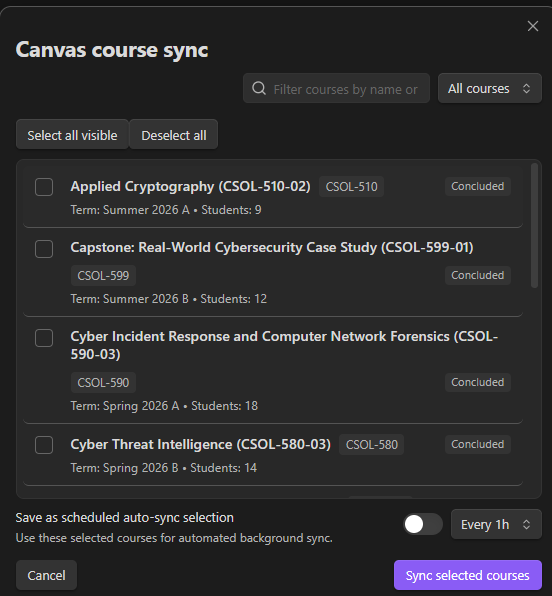
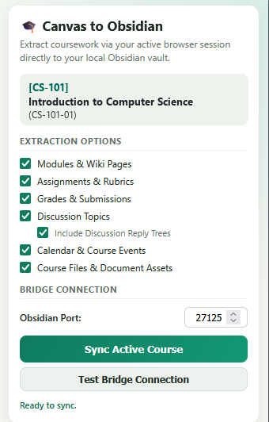
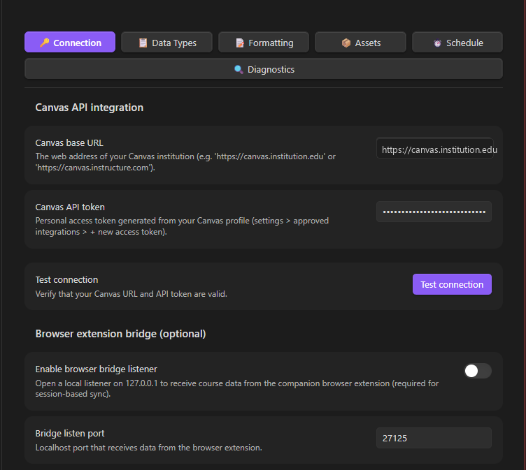
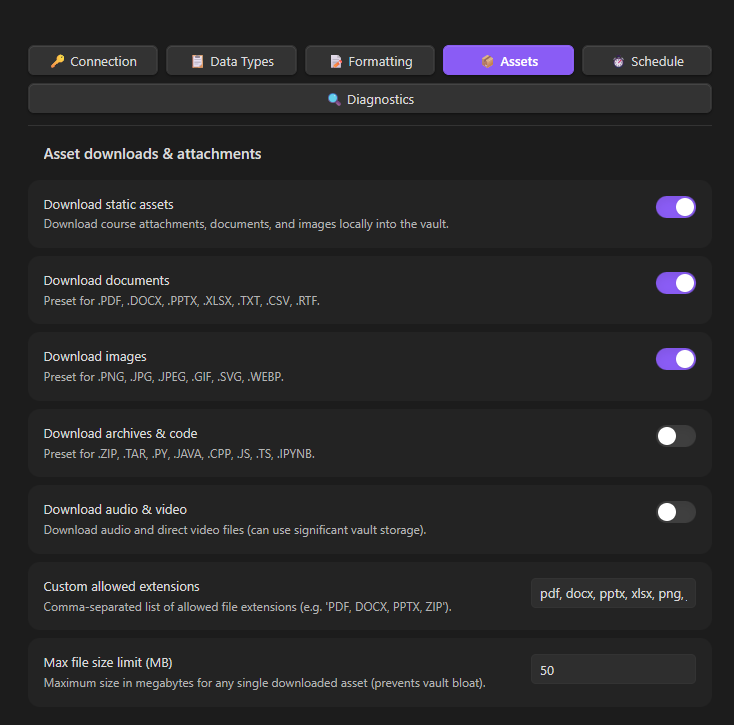

# Canvas Sync Bridge

[](LICENSE)
[](package.json)
[](https://github.com/SixFiveMil/obsidian-canvas-sync/actions/workflows/ci.yml)
[](https://www.typescriptlang.org/)
[](https://community.obsidian.md/plugins/canvas-sync-bridge)
[](https://chromewebstore.google.com/detail/canvas-to-obsidian-sync/oiakmbihplldnhabhnihnekjddenbiom)
[](https://addons.mozilla.org/en-US/firefox/addon/canvas-to-obsidian-sync/)
[](PRIVACY.md)

> Seamlessly sync Canvas LMS courses, modules, assignments, discussions, grades, files, and calendars directly into your Obsidian knowledge vault as clean, structured, and cross-linked Markdown notes.

---

## ✨ Key Features & Hybrid Ingestion

Canvas Sync provides two flexible sync workflows depending on your institutional setup:

### 1. 🎓 Direct Canvas REST API (Primary / Mobile Compatible)
* Direct connection from Obsidian using your Canvas API token.
* Interactive course selector modal with multi-course batch syncing and in-modal auto-sync interval selection.
* **Scheduled Background Sync**: Automatically resyncs active courses on a schedule (15m, 30m, 1h, 2h, 4h, 6h, 12h, 24h) with course selection filters and silent background operation.
* Supports active and completed/concluded courses.
* Fully compatible with **Obsidian Desktop and Obsidian Mobile**.

### 2. 🌐 Companion Browser Extension (Zero-Token Bridge)
* Operates in **Google Chrome, Brave, Edge, Arc, Opera, and Mozilla Firefox**.
* Uses your logged-in browser session cookies — **no API token required** (ideal for institutions locking down student API tokens).
* Granular extraction toggles in the extension popup.
* Bridges securely to Obsidian over localhost (`127.0.0.1`).

---

## 📊 Comprehensive Course Synchronization

Both ingestion pathways feed into a unified rendering engine:
* **Course & Home**: Course overview, home page banners/navigation, and full syllabus formatting.
* **Modules**: Hierarchical module folders, lecture wiki pages, readings, and embedded assets.
* **Assignments & Rubrics**: Due dates, points possible, submission instructions, and structured rubric criteria tables.
* **Student Submissions & Grades**: Live gradebook standing (`Grades.md`), score breakdowns, submitted files, and instructor feedback comments.
* **Discussions**: Full discussion topics, announcements, and complete multi-tier student reply trees (`Discussions.md`).
* **Calendar & Milestones**: Schedule events, assignment due date milestones, and Zoom meeting links (`Calendar.md`).
* **📝 Student Personal Notes Preservation**: Type student notes and annotations freely under `## 📝 Personal Notes` on any course note — personal content is automatically preserved across all future syncs without tag clutter.
* **⏱️ Per-Page "Last Synced" Timestamps**: Every generated note and hub displays a localized timestamp showing exactly when the note was fetched.
* **🛡️ Safe Filename Capping**: Automatically sanitizes and caps oversized module item titles (up to 100 chars) while preserving extensions to prevent OS `ENAMETOOLONG` errors.
* **Internal Obsidian Wikilinks**: Automatically cross-links notes into native Obsidian `[[wikilinks]]` with pipe escaping (`[[path|alias]]`).
* **Local File & Asset Downloader**: Downloads embedded images, assignment attachments, and course documents (`.pdf`, `.docx`, `.pptx`, `.xlsx`, `.zip`) with configurable size and extension filters.
* **100% Local-First & Private**: Zero cloud relays, zero analytics, zero tracking.

---

## 📸 Screenshots

| 1. Interactive Course Selector (REST API) | 2. Companion Browser Extension (Zero-Token) |
| :---: | :---: |
|  |  |

| 3. Canvas API & Bridge Settings | 4. Granular Asset & File Downloads |
| :---: | :---: |
|  |  |

---

## 🚀 Quick Start & Installation

### Step 1: Install the Obsidian Plugin

#### Method A: Community Plugins (Recommended)
1. In Obsidian, open **Settings** > **Community Plugins**.
2. Turn off **Restricted mode** if prompted.
3. Search for **Canvas Sync Bridge**, click **Install**, and then **Enable**.

#### Method B: Obsidian BRAT (Beta Releases)
1. Install the [BRAT Plugin](https://github.com/TfTHacker/obsidian42-brat) in Obsidian.
2. In BRAT settings, click **Add Beta plugin** and enter: `https://github.com/SixFiveMil/obsidian-canvas-sync`.

#### Method C: Manual Installation
1. Download `main.js`, `manifest.json`, and `styles.css` from the [Latest GitHub Release](https://github.com/SixFiveMil/obsidian-canvas-sync/releases/latest).
2. Extract into `<Vault>/.obsidian/plugins/canvas-sync-bridge/` and restart Obsidian.

---

### Step 2: Choose Your Sync Method

#### Option A: Direct REST API (Recommended)
1. In Canvas, go to **Account** > **Settings** > **Approved Integrations** > **+ New Access Token**.
2. Copy the generated token string.
3. In Obsidian settings (**Canvas Sync**), enter your Canvas Base URL and API Token.
4. Press `Ctrl/Cmd + P` and run `Canvas Sync: Select & sync courses` (or click the `🎓` ribbon icon) to sync.

#### Option B: Browser Extension Bridge (Zero-Token Session Sync)
1. In Obsidian settings (**Canvas Sync**), toggle on **Enable browser bridge listener**.
2. Install the extension:
   * **Chrome / Brave / Edge / Arc**: [Chrome Web Store](https://chromewebstore.google.com/detail/canvas-to-obsidian-sync/oiakmbihplldnhabhnihnekjddenbiom)
   * **Firefox**: [Firefox Add-ons (AMO)](https://addons.mozilla.org/en-US/firefox/addon/canvas-to-obsidian-sync/)
3. Navigate to any Canvas course tab in your browser, click the extension icon, test the bridge connection, select your extraction options, and click **Sync Active Course**.

---

## 🗂️ Generated Vault Structure

Courses are written to your vault using the configured template (default: `{{courseCode}} - {{courseName}}`):

```text
Canvas/
└── CS-101 - Introduction to Computer Science/
    ├── Course.md         # Master course index, metadata, and quick navigation
    ├── Home.md           # Course home page with banner and graphic links
    ├── Syllabus.md       # Complete course syllabus and policies
    ├── Tasks.md          # Assignment checklists, due dates, points, and submissions
    ├── Grades.md         # Gradebook table with scores, percentages, and status
    ├── Discussions.md    # Discussion board topics with full student reply trees
    ├── Calendar.md       # Course events, milestones, and Zoom meeting links
    ├── Modules/
    │   ├── 01 - Week 1 - Foundations & Architecture/
    │   │   ├── 01 - Page - Lecture Overview.md
    │   │   ├── 02 - Assignment - Lab 1 Analysis.md
    │   │   └── 03 - Discussion - Class Introductions.md
    │   └── 02 - Week 2 - Algorithms & Data Structures/
    │       ├── 01 - Page - Algorithm Complexity.md
    │       └── 02 - Assignment - Problem Set 2.md
    ├── Files/            # Downloaded PDFs, DOCX, slides, spreadsheets, and archives
    └── Attachments/      # Embedded images, course banners, and diagrams
```

---

## 🛠️ Building from Source

```bash
# Clone repository
git clone https://github.com/SixFiveMil/obsidian-canvas-sync.git
cd obsidian-canvas-sync

# Install dependencies (Node.js 20+ required)
npm install

# Run unit tests
npm test

# Type-check TypeScript files
npm run typecheck

# Build Obsidian plugin
npm run build
```

---

## 🌐 Companion Browser Extension

The browser extension source code, pre-packaged `.zip` release files, and store deployment pipelines are maintained in a dedicated repository:
* **Repository**: [SixFiveMil/canvas-to-obsidian-extension](https://github.com/SixFiveMil/canvas-to-obsidian-extension)
* **Latest Extension Release (.zip downloads)**: [Extension Releases on GitHub](https://github.com/SixFiveMil/canvas-to-obsidian-extension/releases/latest)
* **Chrome Web Store**: [Canvas to Obsidian Sync](https://chromewebstore.google.com/detail/canvas-to-obsidian-sync/oiakmbihplldnhabhnihnekjddenbiom)
* **Firefox Add-ons**: [Canvas to Obsidian Sync](https://addons.mozilla.org/en-US/firefox/addon/canvas-to-obsidian-sync/)

---

## 🔒 Security & Privacy

- **Closed by Default**: The local loopback listener (`127.0.0.1:27125`) only runs when explicitly toggled on in Obsidian settings.
- **Origin & Header Guards**: Inbound requests verify trusted extension origins (`chrome-extension://`, `moz-extension://`) and custom application headers.
- **Local Storage**: API tokens are stored strictly within `.obsidian/plugins/canvas-sync-bridge/data.json` inside your local vault.
- Read our full [Security Policy](SECURITY.md) and [Privacy Policy](PRIVACY.md).

---

## 📄 License & Author

Developed and maintained by **Joshua A. Wortz** ([SixFiveMil](https://github.com/SixFiveMil)).

Licensed under the [MIT License](LICENSE).
