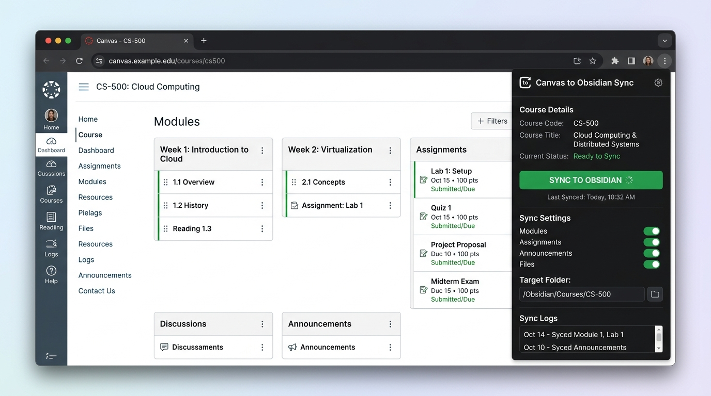
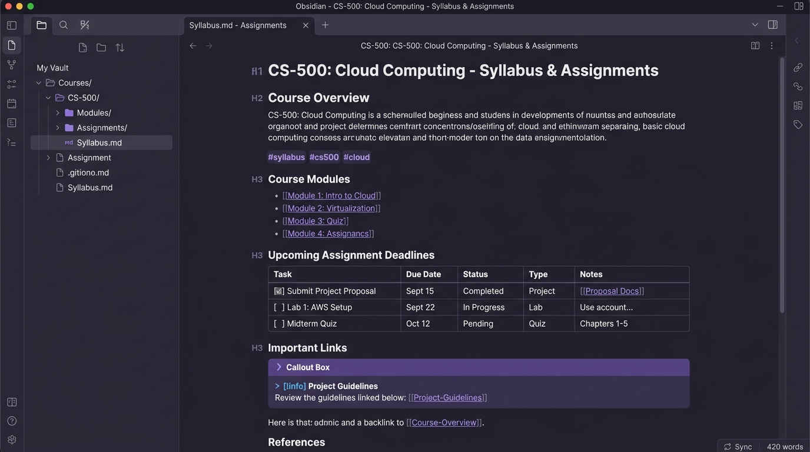

# Canvas to Obsidian Sync

[](LICENSE)
[](package.json)
[](https://github.com/SixFiveMil/obsidian-canvas-sync/actions/workflows/ci.yml)
[](https://www.typescriptlang.org/)
[](https://community.obsidian.md/plugins/canvas-sync-bridge)
[](https://chromewebstore.google.com/detail/canvas-to-obsidian-sync/oiakmbihplldnhabhnihnekjddenbiom?authuser=0&hl=en)
[](https://addons.mozilla.org/en-US/firefox/addon/canvas-to-obsidian-sync/)
[](PRIVACY.md)

> Seamlessly bridge Canvas LMS courses, modules, assignments, and syllabi directly into your Obsidian knowledge vault as clean, structured, and cross-linked Markdown notes.

---

## Key Features

- 🔒 **100% Local-First & Zero Telemetry**: All course extraction occurs client-side in your browser and streams directly to Obsidian over an internal loopback bridge (`127.0.0.1`). No cloud servers, analytics, or third-party tracking.
- ⚡ **Zero Token Friction (Session-Based)**: Extracts rich coursework directly using your existing logged-in browser session. No administrative API tokens or developer keys required.
- 📑 **Clean Markdown & Table Conversion**: Converts messy Canvas HTML, course pacing guides, assignment briefs, and rubric tables into clean GitHub Flavored Markdown (GFM) tables and formatted callouts.
- 🗂️ **Structured Course Vault Layout**: Automatically organizes modules, lectures, assignment checklists, syllabi, and calendar events into an intuitive, customizable folder hierarchy.
- 🌐 **Multi-Browser Support**: Native support for Google Chrome, Brave, Microsoft Edge, Arc, Opera, and Mozilla Firefox.

---

## 📸 Screenshots

| 1. One-Click Browser Sync | 2. Synced Course Vault in Obsidian |
| :---: | :---: |
|  |  |

---

## 🚀 Quick Start & Installation

You need two components: the **Obsidian Desktop Plugin** and the **Companion Browser Extension**.

### Step 1: Install the Obsidian Plugin
1. In Obsidian, open **Settings** > **Community Plugins**.
2. Search for [Canvas Sync Bridge](https://community.obsidian.md/plugins/canvas-sync-bridge), click **Install**, and then **Enable**.
   *(Alternatively, install via BRAT or extract `main.js` and `manifest.json` from the [Latest GitHub Release](https://github.com/SixFiveMil/obsidian-canvas-sync/releases/latest) into `<Vault>/.obsidian/plugins/canvas-sync-bridge/`).*

---

### Step 2: Install the Browser Extension

Install the extension directly from your browser's web store:

| Browser | Store / Download Link |
| :--- | :--- |
| **Google Chrome / Brave / Edge / Arc / Opera** | 🛒 **[Get from Chrome Web Store](https://chromewebstore.google.com/detail/canvas-to-obsidian-sync/oiakmbihplldnhabhnihnekjddenbiom?authuser=0&hl=en)** |
| **Mozilla Firefox** | 🦊 **[Get from Firefox Add-ons (AMO)](https://addons.mozilla.org/en-US/firefox/addon/canvas-to-obsidian-sync/)** *(pending review)* |
| **Direct ZIP (No build required)** | 📦 **[Download Pre-built ZIP from GitHub Releases](https://github.com/SixFiveMil/obsidian-canvas-sync/releases/latest)** |

#### Installing Pre-built ZIP (Manual / Offline — No npm/Node needed):
1. Download `canvas-to-obsidian-sync-chrome-<version>.zip` (or `canvas-to-obsidian-sync-firefox-<version>.zip`) from [GitHub Releases](https://github.com/SixFiveMil/obsidian-canvas-sync/releases/latest).
2. Unzip the file into a folder on your computer.
3. **Chromium (Chrome / Edge / Brave / Arc)**: Go to `chrome://extensions`, enable **Developer mode** (top-right toggle), click **Load unpacked**, and select the unzipped folder.
4. **Firefox**: Go to `about:debugging#/runtime/this-firefox`, click **Load Temporary Add-on...**, and select `manifest.json` in the unzipped folder.

---

### Step 3: Sync Your Canvas Course
1. Open your institution's Canvas LMS in your browser and navigate to any course home page (e.g. `https://canvas.instructure.com/courses/12345`).
2. Click the **Canvas to Obsidian Sync** extension icon in your browser toolbar.
3. Verify the **Bridge Port** matches your Obsidian plugin configuration (`27125` by default).
4. Click **Test Bridge** to confirm connectivity to your active Obsidian instance.
5. Click **Sync Active Course**. The extension will parse course materials and transmit them to your vault in seconds.

---

## 🗂️ Generated Vault Structure

Synced courses are written directly to your vault using the configured template (default: `{{courseCode}} - {{courseName}}`):

```
Canvas/
└── CS101 - Intro to Computer Science/
    ├── Course.md         # Master index note with metadata and quick links
    ├── Home.md           # Course home page content
    ├── Syllabus.md       # Complete syllabus text and course policies
    ├── Tasks.md          # All assignments, due dates, point values, and rubrics
    ├── Discussions.md    # Discussion board topics and prompts
    ├── Calendar.md       # Course events, exam dates, and milestones
    └── Modules/
        ├── 01 - Week 1 - Foundations/
        │   ├── 01 - Page - Welcome & Setup.md
        │   └── 02 - Assignment - Lab 1 Setup.md
        └── 02 - Week 2 - Data Structures/
            ├── 01 - Page - Arrays & Linked Lists.md
            └── 02 - Assignment - Homework 1.md
```

---

## ⚙️ Configuration

### Obsidian Plugin Settings

| Setting | Default Value | Description |
| :--- | :--- | :--- |
| **Listen Port** | `27125` | Local TCP port for the loopback HTTP bridge listener (`127.0.0.1`). |
| **Root Folder** | `Canvas` | Destination folder path within the Obsidian vault for synced course notes. |
| **Course Folder Template** | `{{courseCode}} - {{courseName}}` | Formatting template for course directories. Supports `{{courseCode}}`, `{{courseName}}`, and `{{courseId}}`. |
| **Store Raw Payload** | `false` | When enabled, writes the raw unparsed JSON payload to `_raw_payload.json` for debugging. |

### Browser Extension Options

| Option | Default | Description |
| :--- | :--- | :--- |
| **Bridge Port** | `27125` | Local port of the target Obsidian desktop plugin instance. |
| **Optional Canvas API Token** | *None* | Optional personal Canvas API token for institutions restricting web-based scraping endpoints. Stored strictly in local browser storage. |

---

## ❓ Troubleshooting & FAQs

- **"Test Bridge" fails to connect:**
  - Ensure Obsidian is running with the **Canvas Sync Bridge** plugin enabled.
  - Verify that the port in the extension settings matches the port in Obsidian settings (default: `27125`).
- **Do I need a Canvas API token?**
  - No! The extension automatically uses your logged-in browser session cookies. An API token is only an optional fallback if your institution blocks standard browser endpoints.
- **Is my Canvas data sent to any third-party server?**
  - No. All data flows strictly over your computer's internal loopback interface (`127.0.0.1`) directly from your browser to Obsidian.

---

## 🛠️ Building from Source & Contributing

If you are a developer or contributor wanting to build the project locally from source:

```bash
# Clone repository
git clone https://github.com/SixFiveMil/obsidian-canvas-sync.git
cd obsidian-canvas-sync

# Install dependencies (Node.js 20+ required)
npm install

# Build all targets (Obsidian Plugin + Chrome + Firefox)
npm run build

# Run unit tests across all workspaces
npm test

# Type-check TypeScript files
npx tsc -p apps/browser-extension/tsconfig.json --noEmit
npx tsc -p apps/obsidian-plugin/tsconfig.json --noEmit

# Validate extension manifests and dist artifacts
npm run validate:extension

# Lint Firefox extension with web-ext
npm run lint:extension

# Package extension release archives
npm run package:extension
```

---

## 🔒 Security & Privacy

- **Local-Only Bridge**: The internal HTTP listener binds strictly to `127.0.0.1`. It will never accept connections from outside your local computer.
- **Origin Guard**: Inbound sync requests verify browser extension origins (`chrome-extension://` / `moz-extension://`) and require custom application headers (`X-Canvas-Sync-Client`).
- **Path Traversal Protection**: All folder and file paths are sanitized against illegal filesystem characters and directory traversal patterns.
- Read the complete [Security Policy](SECURITY.md) and [Privacy Policy](PRIVACY.md).

---

## Author & License

Developed and maintained by **Joshua A. Wortz** ([SixFiveMil](https://github.com/SixFiveMil)).

Licensed under the [MIT License](LICENSE).
