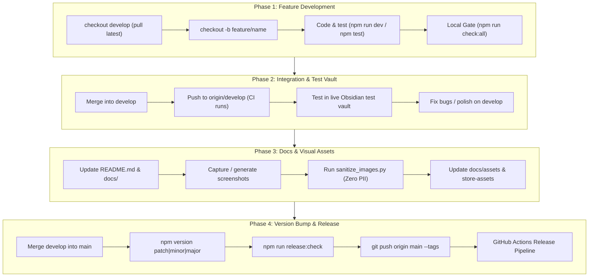

# 📘 Feature Development & Release Runbook

This runbook defines the mandatory 4-stage engineering lifecycle for **Canvas Sync Bridge**. Following this process ensures quality, prevents regressions, keeps documentation and visual assets up-to-date, and guarantees that no release steps are skipped.

---

## 🧭 Workflow Architecture



---

## 🚦 Quick Status Checker

At any time, run:
```bash
npm run runbook
```
This inspects your current git branch, working tree, and version files, telling you exactly which phase you are on and what command to execute next.

---

## 🛠️ Phase 1: Build in a Feature Branch

> [!IMPORTANT]
> Never develop directly on `main` or `develop`. Always branch off an up-to-date `develop`.

### 1.1 Start from Latest `develop`
```bash
git checkout develop
git pull origin develop
git checkout -b feature/<feature-name>
# Examples: feature/canvas-announcements, fix/mobile-ribbon-icon
```

### 1.2 Development Loop
```bash
# Terminal 1: Watch mode compiler (auto-rebuilds main.js on change)
npm run dev

# Terminal 2: Unit test runner in watch mode
npm run test:watch
```

### 1.3 Local Quality Gate
Before creating a pull request or merging, you must pass all quality checks:
```bash
npm run check:all
```
This runs:
1. `npm run lint` — Strict ESLint with zero warnings allowed
2. `npm run typecheck` — TypeScript type validation (`tsc --noEmit`)
3. `npm run test` — Vitest unit test suite
4. `npm run build` — Production esbuild bundle generation

---

## 🧪 Phase 2: Merge to `develop` & Integration Testing

### 2.1 Merge Feature Branch to `develop`
```bash
git checkout develop
git pull origin develop
git merge --no-ff feature/<feature-name>
git push origin develop
```
*(Or submit a Pull Request to `develop` on GitHub and merge once GitHub Actions CI passes).*

### 2.2 Live Obsidian Test Vault Verification
1. Copy the newly compiled `main.js`, `manifest.json`, and `styles.css` into your test vault's plugin folder:
   ```text
   <Your-Obsidian-Vault>/.obsidian/plugins/canvas-sync-bridge/
   ```
2. Reload Obsidian (`Ctrl+R` / `Cmd+R`) or reload plugins in **Settings > Community Plugins**.
3. **Perform Smoke Tests**:
   - [ ] Trigger sync via ribbon icon (`🎓`) and command palette (`Ctrl/Cmd + P`).
   - [ ] Verify Direct REST API course fetching and modal rendering.
   - [ ] Verify Browser Bridge listener mode (if testing bridge features).
   - [ ] Verify note formatting, frontmatter, and personal notes preservation.
   - [ ] Check Obsidian Developer Tools console (`Ctrl+Shift+I`) for any unhandled exceptions or warnings.

### 2.3 Repair & Fix
If regressions are discovered during smoke testing, fix them on `develop` (or a dedicated `fix/*` branch), verify with `npm run check:all`, and re-test.

---

## 📸 Phase 3: Build Documentation & Update Screenshots

> [!TIP]
> Keep documentation and screenshots synchronized with the current UI to avoid user confusion and keep store submissions valid.

### 3.1 Documentation Updates
- Update [README.md](file:///d:/repos/obsidian-canvas-sync/README.md) with new features, options, or changes.
- Update [ARCHITECTURE.md](file:///d:/repos/obsidian-canvas-sync/docs/ARCHITECTURE.md) if internal designs or bridge contracts changed.
- Update [releasing.md](file:///d:/repos/obsidian-canvas-sync/docs/releasing.md) or platform guides as needed.

### 3.2 Visual Asset & Screenshot Updates
When UI changes are made (modals, settings tab, popup):
1. **Capture updated screenshots** in high resolution.
2. **Store documentation assets** in `docs/assets/`:
   - `screenshot_course_selector.png`
   - `screenshot_extension_popup.png`
   - `screenshot_plugin_settings.png`
   - `screenshot_asset_settings.png`
3. **Store submission assets** in `docs/store-assets/` (if updating web store/AMO listings). You can run:
   ```bash
   python scripts/generate_store_screenshots.py
   ```
4. **Sanitize screenshots**: Ensure zero real student/instructor names, Canvas API tokens, or internal URLs appear:
   ```bash
   python scripts/sanitize_images.py
   ```
5. Commit the updated documentation and screenshot assets to `develop`:
   ```bash
   git add README.md docs/
   git commit -m "docs: update documentation and screenshots for <feature>"
   git push origin develop
   ```

---

## 🚀 Phase 4: Deploy New Version

### 4.1 Merge `develop` into `main`
```bash
git checkout main
git pull origin main
git merge --no-ff develop
```

### 4.2 Version Bump
Use `npm version` to bump the version. This automatically executes `scripts/sync-version.mjs`, which synchronizes `manifest.json` and `versions.json` and stages them in git:
```bash
# Choose one based on semantic versioning:
npm version patch   # 0.5.0 -> 0.5.1 (bugfixes / small tweaks)
npm version minor   # 0.5.0 -> 0.6.0 (new features / enhancements)
npm version major   # 0.5.0 -> 1.0.0 (breaking architectural changes)
```

### 4.3 Final Pre-Release Verification
Run the automated release verification gate:
```bash
npm run release:check
```
This confirms:
- [x] You are on `main`
- [x] `package.json`, `manifest.json`, and `versions.json` versions match exactly
- [x] `main.js`, `manifest.json`, and `styles.css` exist and are populated
- [x] Linting, typechecking, tests, and production build all succeed

### 4.4 Push and Publish
```bash
git push origin main --tags
```

### 4.5 GitHub Release Workflow
1. Pushing the version tag triggers `.github/workflows/release.yml`.
2. GitHub Actions will:
   - Run the automated test suite and type check.
   - Attest build provenance using GitHub artifact attestations.
   - Create a GitHub Release with `main.js`, `manifest.json`, and `styles.css` attached.
3. Verify the release at: `https://github.com/SixFiveMil/obsidian-canvas-sync/releases`.

---

## 📋 Interactive PR / Release Checklist

Copy this checklist into your GitHub PR or release tracking issue:

```markdown
### 1. Feature Development
- [ ] Created feature branch from latest `develop`
- [ ] Implemented feature with unit tests
- [ ] Passed local gate: `npm run check:all`

### 2. Integration & Smoke Testing
- [ ] Merged to `develop`
- [ ] Copied bundle to local Obsidian test vault
- [ ] Tested sync with real Canvas course / mock data
- [ ] Verified console is free of errors

### 3. Documentation & Screenshots
- [ ] Updated `README.md` and feature docs
- [ ] Updated screenshots in `docs/assets/`
- [ ] Sanitized visual assets (no tokens/PII)

### 4. Release & Deployment
- [ ] Merged `develop` to `main`
- [ ] Bumped version (`npm version patch|minor|major`)
- [ ] Passed release check: `npm run release:check`
- [ ] Pushed with tags: `git push origin main --tags`
- [ ] Verified GitHub Release assets and CI badge
```

---

## ⚡ Command Cheatsheet

| Goal | Command |
|---|---|
| Check current workflow phase | `npm run runbook` |
| Local watch compilation | `npm run dev` |
| Run all quality gates | `npm run check:all` |
| Sync version metadata manually | `npm run version:sync` |
| Bump version (patch/minor/major) | `npm version patch` |
| Verify release readiness | `npm run release:check` |
| Deploy tag to GitHub | `git push origin main --tags` |
